# Photo calendar using R

This repo contains R script and sample images to create a photo calendar. Detailed description is provided in this [blog post]( https://www.royfrancis.com/photo-calender-using-r/). 

* File **script.R** contains the R script.
* Files **marked.txt** and **captions.txt** are information used on the calendar.
* The directory **images** contains raw background images in A3 size. 
* The directory **calendar_A3** contains the final calendar pages. 
* The directory **images_small** contains small versions of the calendar. 

Below are previews of the calendar.

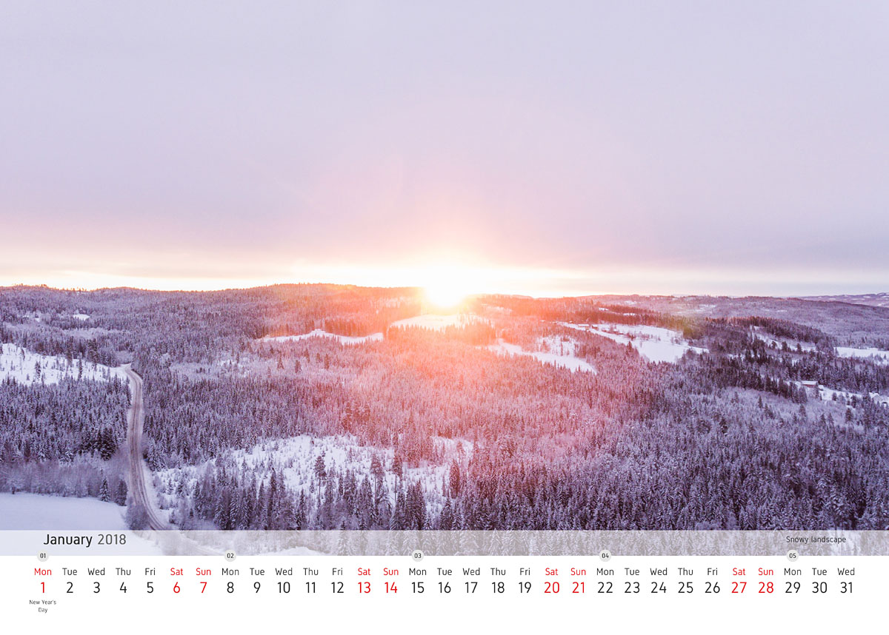
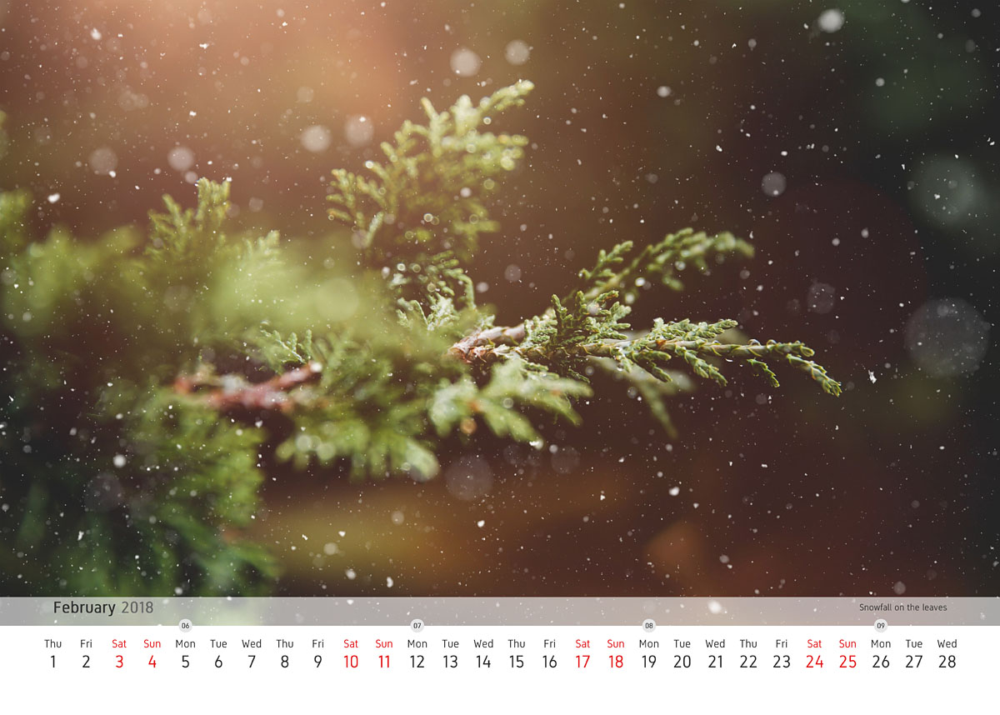
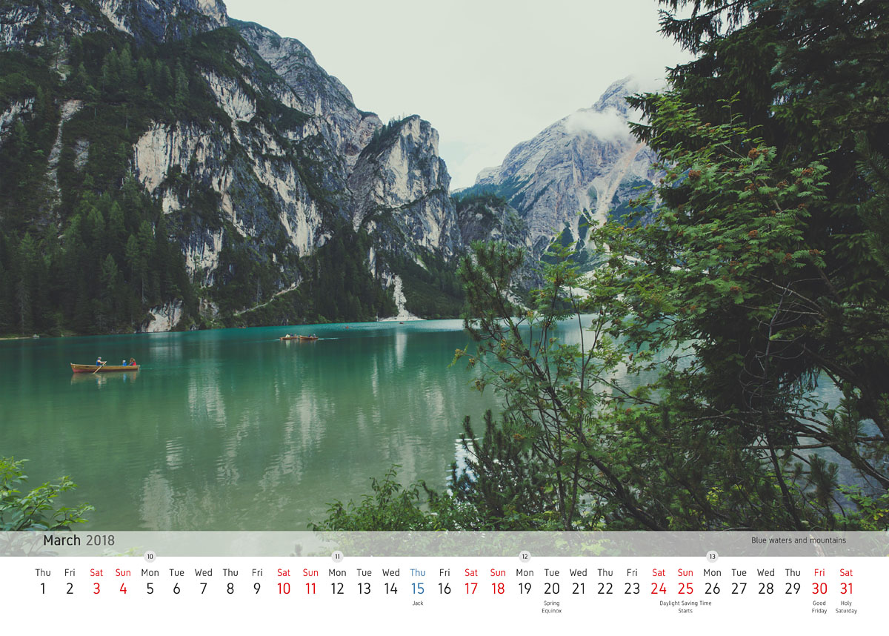
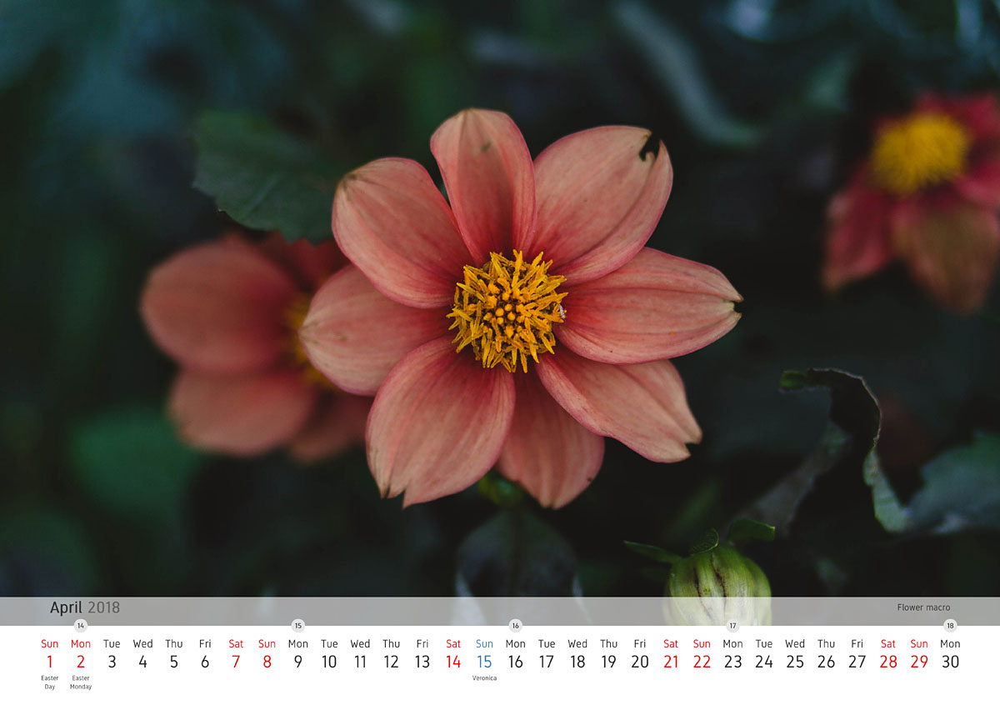
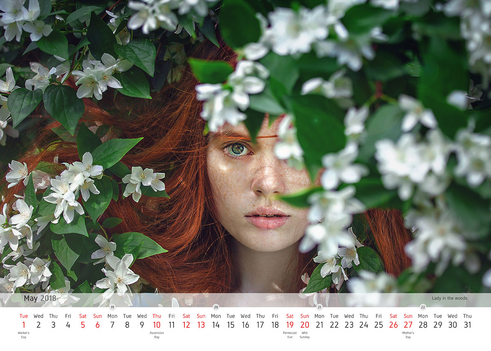
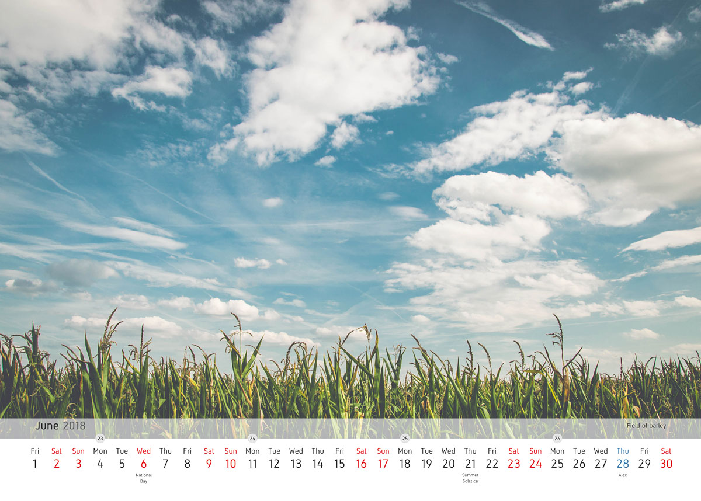
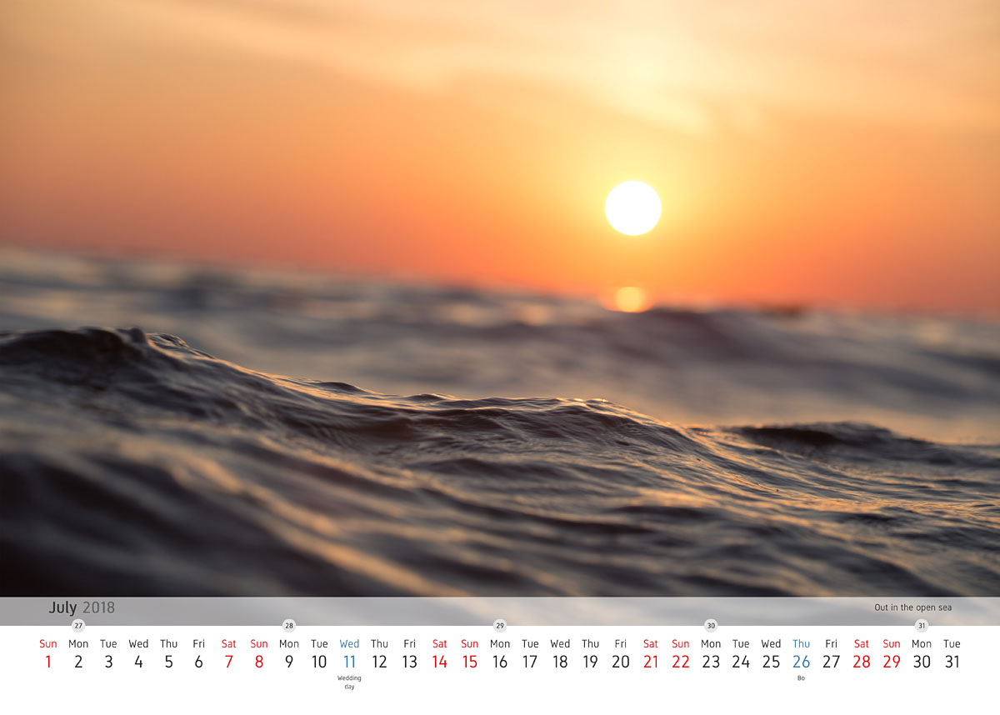
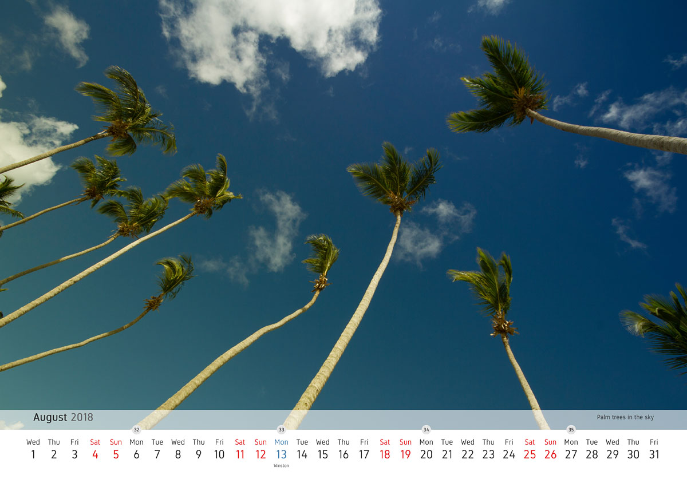
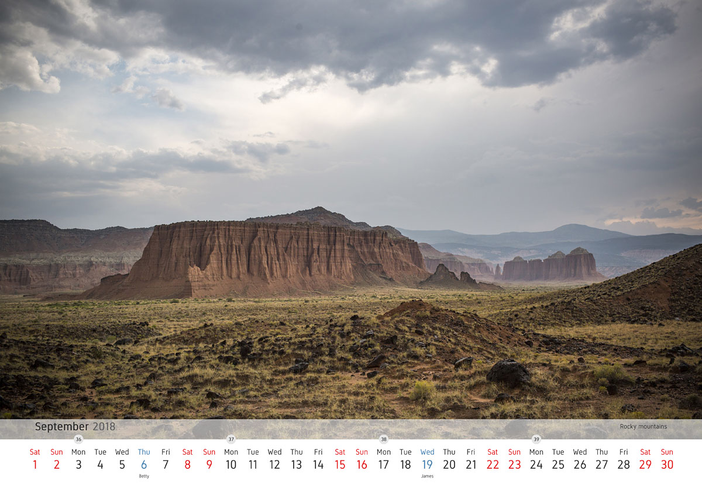
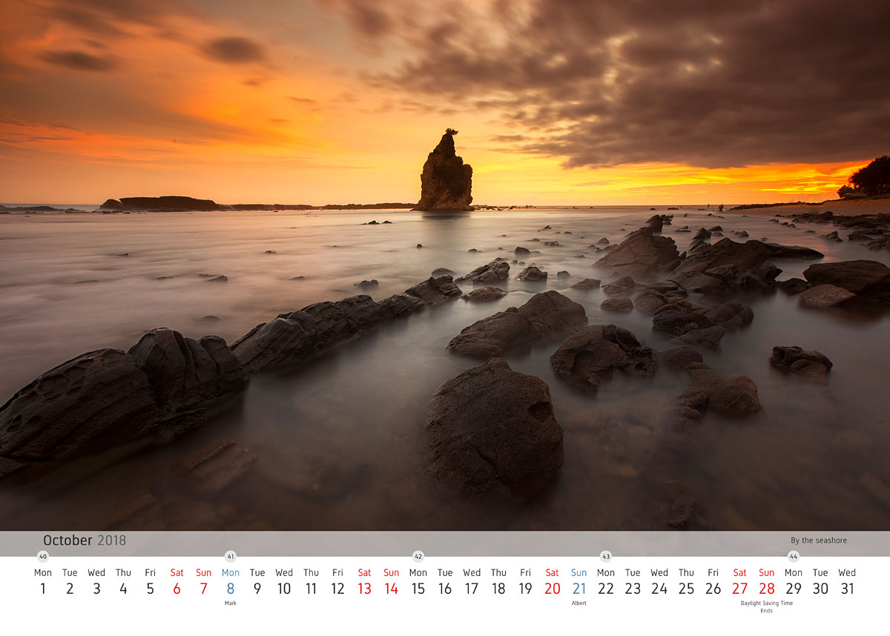

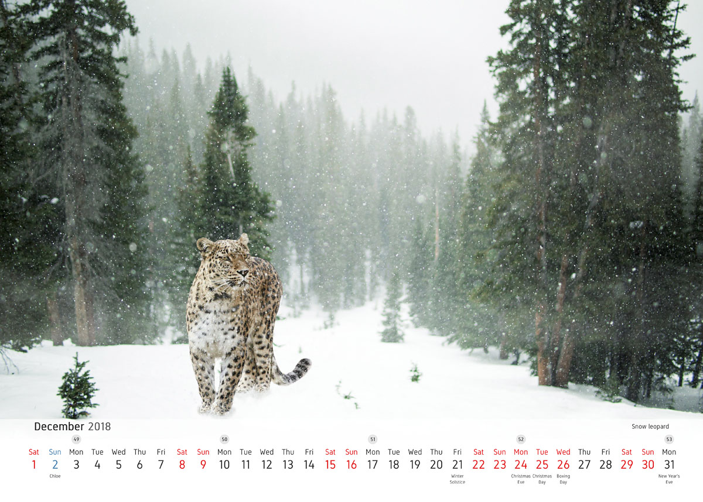
